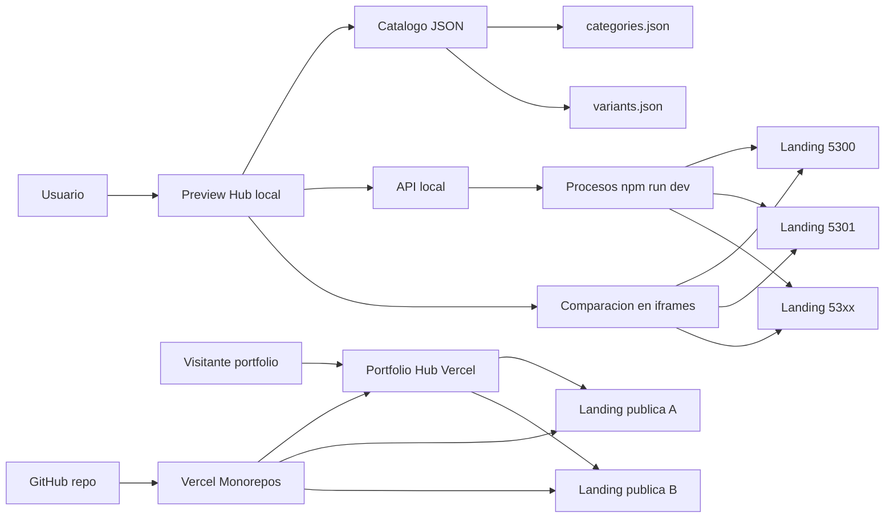

# Previews Hub Landings

Monorepo de landings gastronomicas con dos hubs: uno local para revisar previews durante el trabajo y uno publico para mostrar landings deployadas en Vercel como portfolio.

## Que Hace

- Organiza 31 landings React Router por categoria gastronomica.
- Expone un hub local para filtrar por categoria, buscar por nombre/carpeta y comparar landings en iframes.
- Incluye `apps/portfolio-hub`, una app publica para mostrar 10 landings deployadas.
- Inicia cada landing bajo demanda en un puerto local propio.
- Permite iniciar todas las previews cuando hace falta revisar el set completo.
- Mantiene una matriz de categorias y variantes en `restaurant-templates/categories.json` y `restaurant-templates/variants.json`.
- Esta preparado para Vercel Monorepos: cada landing puede deployarse como proyecto independiente usando su `Root Directory`.

## Que No Hace

- No deploya automaticamente las 31 landings.
- No reemplaza al dashboard de Vercel para crear proyectos por landing.
- No persiste estado, logs ni seleccion de comparacion.
- No usa base de datos ni servicios externos.
- No debe subirse con `node_modules`, `build`, `.react-router` ni `.vercel`; esos artefactos quedan ignorados.

## Como Correrlo

Requisitos:

- Node.js 22 o superior.
- npm.

Instalacion:

```bash
npm ci
```

Usar la version sugerida con `nvm`:

```bash
nvm use
```

Correr el hub:

```bash
npm run preview:hub
```

Abrir la URL que imprime la terminal, normalmente:

```text
http://127.0.0.1:5170/
```

Correr el hub e iniciar todas las landings:

```bash
npm run preview:all
```

Validar el proyecto:

```bash
npm run check:hub
npm run build
npm run typecheck
```

## Como Publicarlo En Vercel

Para que lo vea cualquier persona, hay que deployar:

1. `apps/portfolio-hub` como el hub publico.
2. Las 10 landings seleccionadas como proyectos separados.
3. Confirmar que las URLs en `apps/portfolio-hub/data/landings.json` coincidan con los dominios que te dio Vercel.
4. Un nuevo deploy del hub publico para que muestre los links y previews.

El hub publico no levanta procesos locales: muestra y embebe URLs ya deployadas. El JSON ya trae URLs esperadas tipo `https://<projectName>.vercel.app`; si Vercel te da otro dominio, reemplazas ese valor.

Config del proyecto Vercel para el hub publico:

| Setting | Valor |
| --- | --- |
| Root Directory | `apps/portfolio-hub` |
| Framework Preset | `Other` |
| Build Command | `npm run build` |
| Output Directory | `dist` |

Landings seleccionadas para el primer portfolio publico:

| Landing | Root Directory | Project sugerido |
| --- | --- | --- |
| Restaurante | `restaurant-templates/restaurantes/template-01-airbnb/landing` | `restaurantes-airbnb` |
| Comida argentina | `restaurant-templates/comida-argentina/template-02-mastercard/landing` | `comida-argentina-mastercard` |
| Comida rapida | `restaurant-templates/comida-rapida/template-01-uber/landing` | `comida-rapida-uber` |
| Delivery | `restaurant-templates/comida-delivery/template-02-shopify/landing` | `comida-delivery-shopify` |
| Bar | `restaurant-templates/bares/template-01-spotify/landing` | `bares-spotify` |
| Cafeteria | `restaurant-templates/cafeteria/template-02-notion/landing` | `cafeteria-notion` |
| Desayuno | `restaurant-templates/desayuno/template-03-airbnb/landing` | `desayuno-airbnb` |
| Bebidas | `restaurant-templates/bebidas/template-03-pinterest/landing` | `bebidas-pinterest` |
| Helados | `restaurant-templates/helados/template-01-clay/landing` | `helados-clay` |
| Cocina internacional | `restaurant-templates/comida-internacional/template-03-mastercard/landing` | `comida-internacional-mastercard` |

## Endpoints Del Hub

El hub corre localmente con `npm run preview:hub`. Por defecto usa `http://127.0.0.1:5170`.

| Metodo | Endpoint | Descripcion |
| --- | --- | --- |
| `GET` | `/` | UI del hub local. |
| `GET` | `/api/landings` | Devuelve categorias, landings, URLs locales, puertos y estado actual. |
| `POST` | `/api/start` | Inicia varias landings por `ids`. |
| `POST` | `/api/start/:id` | Inicia una landing puntual. |
| `POST` | `/api/stop` | Detiene procesos iniciados por el hub. |
| `GET` | `/api/logs/:id` | Devuelve logs recientes de una landing. |

Puertos por defecto:

| Variable | Default | Uso |
| --- | --- | --- |
| `HUB_HOST` | `127.0.0.1` | Host del hub. |
| `HUB_PORT` | `5170` | Puerto inicial del hub. Si esta ocupado, busca otro cercano. |
| `PREVIEW_HOST` | `127.0.0.1` | Host de las landings. |
| `LANDING_BASE_PORT` | `5300` | Primer puerto usado por las landings. |
| `START_ALL` | `0` | Con `1`, inicia todas al levantar el hub. |

## Ejemplos De JSON

### `GET /api/landings`

Respuesta abreviada:

```json
{
  "categories": [
    {
      "slug": "restaurantes",
      "label": "Restaurantes"
    }
  ],
  "landings": [
    {
      "id": "restaurantes--template-01-airbnb",
      "categorySlug": "restaurantes",
      "categoryLabel": "Restaurantes",
      "templateDir": "template-01-airbnb",
      "templateOrder": 1,
      "variantName": "Airbnb",
      "styleSlug": "airbnb",
      "packageName": "landing-restaurantes-airbnb",
      "relativePath": "restaurantes/template-01-airbnb/landing",
      "port": 5300,
      "url": "http://127.0.0.1:5300/",
      "state": {
        "status": "stopped",
        "external": false,
        "startedAt": null,
        "exitCode": null
      }
    }
  ]
}
```

### `POST /api/start`

Request:

```json
{
  "ids": [
    "restaurantes--template-01-airbnb",
    "bares--template-01-spotify"
  ]
}
```

Respuesta abreviada:

```json
{
  "results": [
    {
      "id": "restaurantes--template-01-airbnb",
      "url": "http://127.0.0.1:5300/",
      "state": {
        "status": "running",
        "external": false,
        "startedAt": "2026-05-12T05:39:55.494Z",
        "exitCode": null,
        "error": null
      }
    }
  ],
  "errors": []
}
```

### `GET /api/logs/:id`

Respuesta:

```json
{
  "id": "restaurantes--template-01-airbnb",
  "logs": [
    "[02:39:55] Starting restaurantes/template-01-airbnb/landing on http://127.0.0.1:5300/",
    "[02:39:56] Local: http://127.0.0.1:5300/"
  ]
}
```

## Diagrama



## Estructura

```text
.
├── package.json
├── package-lock.json
├── VERCEL.md
├── apps/
│   └── portfolio-hub/
├── base-wireframe/
└── restaurant-templates/
    ├── categories.json
    ├── variants.json
    ├── tools/
    │   └── preview-hub.mjs
    └── <categoria>/<template>/landing/
```

## Deploy En Vercel

El repo esta preparado para Vercel Monorepos. Cada landing se importa como proyecto separado usando su carpeta `landing` como `Root Directory`.

Ver la guia completa en [VERCEL.md](./VERCEL.md).

El primer corte recomendado es `hub publico + 10 landings`. Cuando eso este funcionando, se puede ampliar el JSON y deployar las 31.
